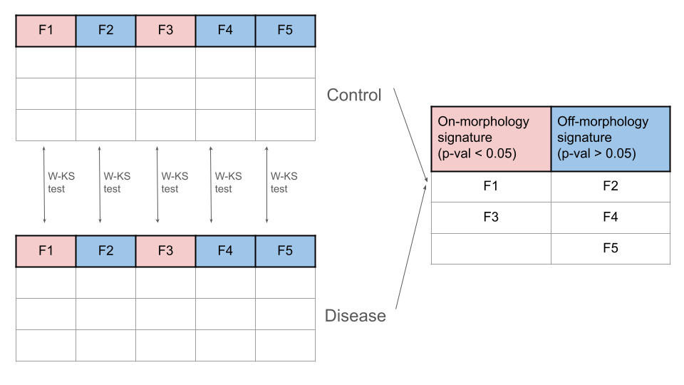
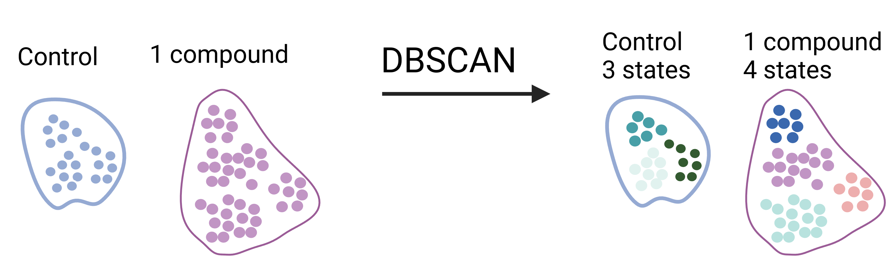
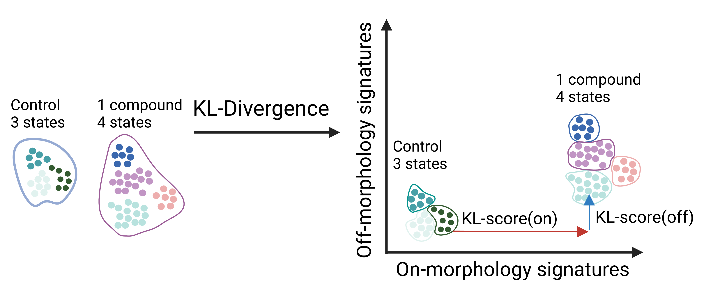

# CFReT Drug Screen

## About

This repository contains an analytical method designed to identify and prioritize compounds that can reverse the effects of Cardiac Fibrosis (CF), restoring them to a healthy cellular state.

Our approach focuses on distinguishing morphological features associated with disease from those that remain unaffected at the single-cell level.
By comparing these features to healthy controls, we identify which morphological characteristics are significantly altered in the disease state (on-morphological signatures) and which are not (off-morphological signatures).
The "on" signatures highlight disease-related changes, while the "off" signatures serve as indicators of potential off-target effects when cells are exposed to various compounds.

By quantifying the distances between these "on" and "off" morphological signatures, our method prioritizes compounds based on their ability to minimize both on-target and off-target effects. 
Ideally, the method selects compounds that produce low scores in both "on" and "off" signatures, indicating a close resemblance to the healthy control state with minimal off-target effects.

## Approach

### Obtaining CF high-content screening (HCS) single-cell image-based profiles

Image-based profiles were generated from HCS using the [Cell Painting](https://www.nature.com/articles/nprot.2016.105) assay.
The screen encompasses 550 different compounds.
It includes three control types: non-failing heart cells (positive control), failing heart cells with fibrosis (negative control), and a transforming growth factor receptor inhibitor (TGFRi) representing a compound that deactivates the failing state.
These profiles were obtained using a data analysis [repository](https://github.com/WayScience/targeted_fibrosis_drug_screen), which includes the necessary instructions for downloading the dataset.

### Processing image-based profiles obtained from HCS to generated single-cell feature-selected profiles

> **Processing pipeline for image-based profiles.** An overview of the process used to obtain single-cell feature-selected profiles from single-cell image-based data using Pycytominer.

We will process these profiles using [Pycytominer](https://github.com/cytomining/pycytominer).
The first step is to annotate each single cell with the metadata associated with each plate.
Next, we apply a standard scaler to normalize each feature to zero mean and unit variance.
Following normalization, we perform feature selection by dropping morphological feature columns that have more than 5% missing values and extreme values.
We will also apply variance and correlation thresholds to remove features with low variance, which do not contribute significant information, and to eliminate highly correlated features.
Through this pipeline, this results in single-cell feature-selected profiles

### Determining on/off morphological signatures

**Using KL-divergence to measure morphological effect.** After clustering the single-cell populations, we apply KL divergence to measure the magnitiude of both the on and off morpholoigcal signatures.  on/off morphological signatures, we conducted a weighted Kolmogorov-Smirnov (WKS) test.
This test helps determine which morphological features are significantly different by providing both a p-value and a measure of how distinct the cumulative distribution functions (CDFs) are for each feature.
Morphological features with a p-value lower than 0.05 are categorized in the "on-morphology signature" group, indicating they are significantly different compared to the control.
Features with a p-value greater than 0.05 are placed in the "off-morphology signature" group, signifying they were not affected in the disease state.
Establishing these two groups allows us to assess whether specific chemical or genetic perturbations/treatments effectively target the intended morphological features ("on-morphology signatures") while minimizing impact on those not associated with the disease state ("off-morphology signatures").

### Identifying cellular heterogeneity

>**Identifying heterogeneity in single-cell populations.** In the single-cell profile space, we apply DBSCAN to identify the number of clusters within the populations, which indicates different cellular states from a morphological perspective.

Given that cells may respond differently to the same compound, leading to heterogeneous effects within populations, we will use Density-Based Spatial Clustering of Applications with Noise ([DBSCAN](https://scikit-learn.org/stable/modules/generated/sklearn.cluster.DBSCAN.html).
DBSCAN will identify distinct clusters of single cells within the perturbation and healthy control groups without requiring us to predefine the number of clusters.
Each identified cluster will represent a distinct "morphological drug response" state, capturing variations in the on/off morphological signatures from cells exposed to compounds at different cellular stages within the same population.

### Calculating on/off morphological signatures

>**Using KL-Divergence to Measure Morphological Effects.** After clustering the single-cell populations, we apply KL divergence to quantify the magnitude of both the on and off morphological signatures.

We uzse calculate the Kullback-Leibler (KL) divergence to measure the differences between the probability distributions of all pairs of perturbation/healthy control clusters for each on/off morphology signature feature set independently.
By summing the maximum KL divergence distances for the on/off-morphology signatures, we can quantify how distinct each perturbation cluster is from the healthy controls.
We aim to identify hits by focusing on perturbations with low KL scores in both "off-morphology" and "on-morphology" signatures. A low "off-morphology signature" score indicates minimal off-target effects in the morphology space.
Conversely, a low "on-morphology signature" score suggests that the morphological features of treated cells closely resemble those of the control state.
