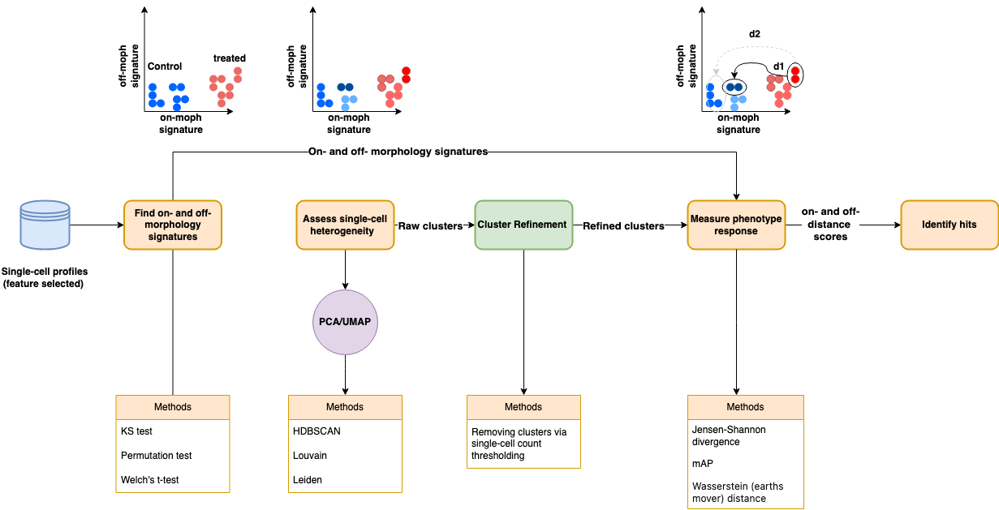

# buSCar

## About

buSCar (**B**ioactive **U**nbiased **S**ingle-cell **C**ompound **A**ssessment and **R**anking) is a framework designed to leverage single-cell profiles to identify effective compounds in high-content drug screening.
The name "buSCar" is also a play on the verb "buscar," which means "to search" or "to seek" in both Spanish and Portuguese, reflecting the framework's goal of searching for and prioritizing effective compounds.
Traditional high-content screening approaches typically use population-based (aggregated) profiles to evaluate the morphological activity induced by compounds, but these aggregated profiles can obscure the biological heterogeneity present when cells are exposed to different compounds.
buSCar addresses this limitation by analyzing single-cell profiles, enabling a more nuanced assessment of compound activity.

The framework emphasizes interpretability by identifying which morphological features are strongly associated with specific cell states, as well as those that remain unaffected.
This distinction is crucial for tracking both on-target and off-target morphological effects during compound screening.
By integrating these perspectives, buSCar helps prioritize compounds that are most effective for specific tasks, such as phenotype reversal.


## Implementation

> **Figure:** Schematic overview of the buSCar framework, highlighting its five main modules and their roles in compound assessment.

buSCar has 5 main modules:

| Module        | Description                                                                                                                                                                                                                                                                                |
| ------------- | ------------------------------------------------------------------------------------------------------------------------------------------------------------------------------------------------------------------------------------------------------------------------------------------ |
| Signatures    | Identifies morphological features between two profiles (e.g., healthy vs. disease). Features altered by perturbations are "on-morphology signatures"; unchanged features are "off-morphological features." This distinction helps pinpoint impacted features and track off-target effects. |
| Heterogeneity | Assesses heterogeneity within single-cell populations using (1) dimensionality reduction (e.g., UMAP or PCA), and (2) clustering. Cells are mapped back to their original space to assign cluster labels.                                                                                  |
| Refinement    | Evaluates clusters from the Heterogeneity module to remove uninformative or small clusters (e.g., those with few cells), which can skew phenotypic measurements due to label imbalance.                                                                                                    |
| Activity      | Measures the phenotypic activity of selected treatment groups versus controls using both on-morphology and off-morphological signatures. Produces two scores: one for on-morphology activity, and one for off-morphology activity.                                                         |
| Hits          | Identifies compounds that perform well based on both on-morphology and off-morphological activity scores from the Activity module.                                                                                                                                                         |


## How to install

### 1. Clone the Repository

Start by cloning the buSCar repository and navigating into the project directory:

```bash
git clone https://github.com/WayScience/BuSCar.git
cd BuSCar
```

### 2. Set Up a Conda Environment

Create and activate a dedicated Conda environment for buSCar:

```bash
conda create -n buSCar python=3.12
conda activate buSCar
```

### 3. Install Poetry

Install Poetry within your Conda environment to manage project dependencies:

```bash
conda install poetry
```

### 4. Install Project Dependencies

With Poetry installed and your environment activated, install all required dependencies:

```bash
poetry install
```

This command will set up all packages as specified in the `pyproject.toml` and `poetry.lock` files.
